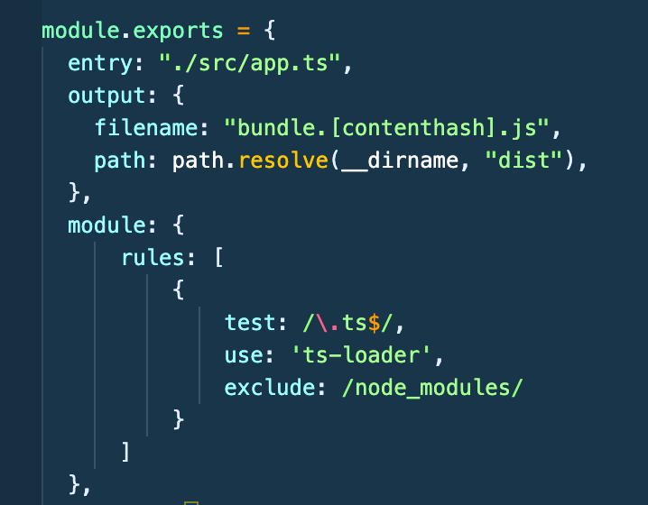

# Typescript Notes Section 11 - Udemy Schwarmuller

## Webpack With Typescript

### Performance Gains With ESM's

- The ease of using ES Modules as constructed in our last version of our Project leads to one disadvantage. **_Although the browser is perfectly capable of pulling/rendering from separate modules, it will make a separate HTTP request for each separate module in each subfolder, which can have a drastic effect on performance, especially when client's have less than optimal bandwidth_**

- Even when your individual files are small, and downloading might be quick **_There is a basic overhead for any HTTP request, and that will add up_**

- Note the separate GET requests made for each of our separate ES Modules
  

- **_Webpack is a bundling and 'build-orchestration' tool._** And will solve the above problem by bundling all of our modules into 1 optimized .js file

#### Typical Webpack Dev Dependencies In Node Project

- Below is a snapshot of a typical base development setup for using webpack with typescript. It includes webpack itself, webpacks development server, the command line interface, and we also include a current copy of Typescript in case we want to change types or make edits later on without breaking our app. TS-Loader is a webpack plugin for using Typescript
  

### Entry And Output Config

- You'll need to make sure in your tsconfig.json file that you have your target set to ES5 or ES6 (currently). For webpack to know what to transpile to.
- Module should also be ES5 or ES2015(ES6).
- Also verify your outDir folder to be sure it's the one you want. **_However you no longer will need the rootDir option enabled as webpack will take over root directory formatting_**
- You'll then want to create a **webpack.config.js** (use that exact naming) file (or you can split configs for dev and prod as we've seen before)
- **_You need to remove the .js extensions in your source code imports_** because webpack automatically will assume they're .js

- Below we specify the relative path to the entry file of our app. This is ofcourse app.ts. We then open an object for the output key and specify what we want our output bundle to be named. **_Note: If you use the dynamic content-hashing shown in the image below, you will have to utilize webpack's index.js dynamic html feature, see the docs_**
  

- Now, for the output path. **_Webpack want's an absolute path instead of relative like we used for the entry_**. What we'll do to construct this is create a constant above to utilize Node's runtime to determine the output file's path.
  
- Above we use Node's built in path module to have Node create the absolute path, appending the 'dist' folder on it at webpack build time

### Utilizing TS-Loader Webpack Plugin

- We'll add a **module** key to our webpack config to specify what plugins we want to use
- Next add the **rules array** to the module object, and include another object with the first key of **test**. The test key will tell webpack basically what to look/test for in order to apply the associated rule
- **test** will take a regular expression which will have the file extensions to look for
  
- Above we tell webpack that for any typescript file found, **_use_** the ts-loader plugin, and just for safety explicitly exclude node_modules so webpack won't look in there. Note: ts-loader knows to utilize your tsconfig.json file for it's instructions.
- Finally using the **_resolve_** key in webpack config. We tell webpack to look for any .ts files and .js files to bundle them.
  
- You will almost **_always want sourceMap=true in your tsconfig_** as webpack supports the source mapping which will make debugging far simpler than not including it.
- To enable the sourcemapping in your webpack.config.js .. add a key of **_devtool_** set to a string of **_'inline-source-map'_**
- Afterwhich you're ready to use webpack to compile/bundle, usually you'll want to add a script to your package.json like:

```
"scripts": {
    "build": "webpack",
}
```

#### HTTP Requests After Bundling

- The advantage is obvious
  

### Using Dev-Server And Workflows

- In our example case simply change the package.json start script to "webpack-dev-server" . Now in most projects you'll want to make a separate _development config_ for webpack. But otherwise that's all you need to do to run the webpack dev server
- **_Big NOTE: If you're using the most recent versions of Webpack and Webpack-CLI, You will likely have to downgrade the webpack-cli to an older version to run the dev-server in this particular way_** See: https://stackoverflow.com/questions/40379139/cannot-find-module-webpack-bin-config-yargs

#### The Dreaded PublicPath Key

- When trying to run the webpack dev-server you will often run into bizarre behavior when you try and reload code. First remember that the dev-server creates your bundle in-memory, so you won't see a new bundle.js in your dist folder (in our setup used here).
- To fix some of these issue you will have to specify the publicPath key in the webpack.config.js file. In our project here, you'll set it to look at the dist folder.
  
- Essentially you have to tell webpack where your TS or JS assets are relative to the index.html file with the publicPath key
- You can add the 'development' and 'production' values to the **mode** key in webpack.config.js

### Production Workflow

- This is where we will add a separate webpack.config.prod.js file
- This stage you will remove the keys from your config used for development only.. change the mode from dev to prod, remove publicPath key.
- You will add optimization plugins at this stage by adding the **plugins:** key to the prod config
- NPM install and import the plugins that you'll want for prod. i.e. clean-webpack-plugin. In our example project here, this is all we will add to plugins, but of course webpack has a lot of optimizing plugins that can be added
- Add a script to your package.json to build for prod and you're done
  
- Note we instruct webpack to use our production config on build now.

### BIG NOTE:

- For whatever stupd f'n reason, the config key **_devtool_** will have to be removed entirely from the production config variant as it will cause the build to fail without any clues as to what's failing.
