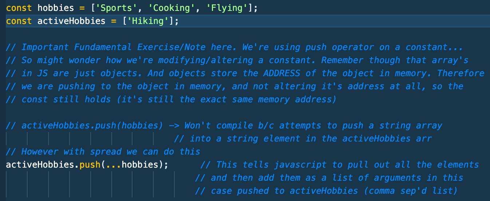
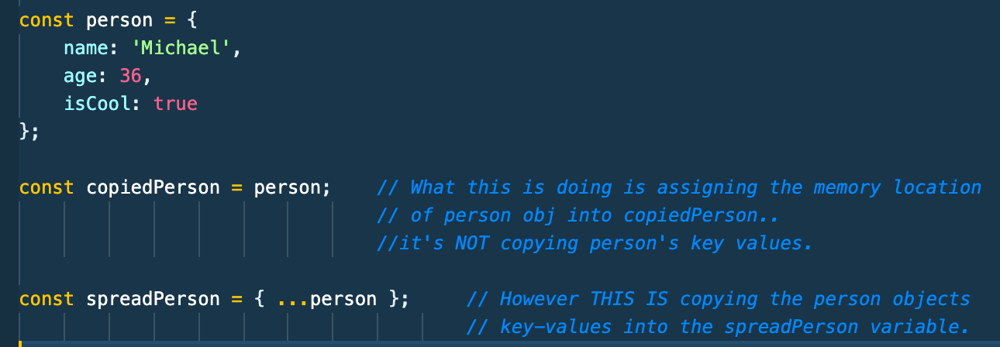
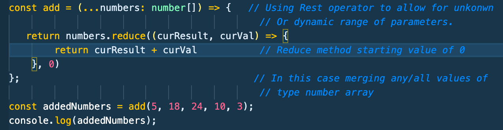
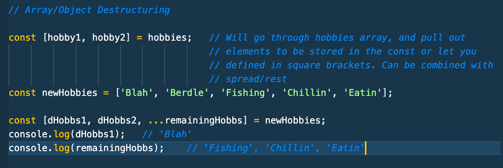
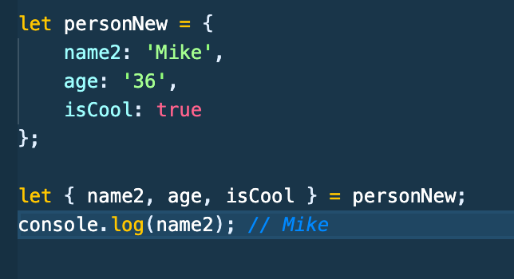

# Typescript Notes Section 3 - Udemy Schwarmuller Course

## Next Gen Typescript and Javascript Features

### Let/Const

- Obviously declaring a value with const will lock it. Instead of thinking of const as a variable, you should think of it as a one-time definition.. a constant!
- var is still supported, but you shouldn't use it anymore. var will work in both function and global scopes. But if you have an **_if statement_** for example, it will reach out to the higher scope. An undesirable characteristic. Javascript doesn't know any other scopes for var other than global and function.
- let and cost both will work in **_block scope_** meaning JS understands global, function, and block scoping with let and const.

### Arrow Functions

- If you **_only have one_** expression. You can omit curly braces and omit the return statement (implicit return);
- If you have a function that **_only takes one parameter_** you can omit parenthesis.
- You don't use _call, bind, or apply_ with arrow functions, arrow functions have no inherent _this_ so their _this_ will point to the scope they reside in.

```
const add = (a: number, b: number) => a + b;
const print = msg => console.log(msg);  // regular js, this will not compile in TS  with param typing only shown to show single param no paren
```

### Default Function Parameters

- NextGen JS allows for setting default parameters written like so: (setting argument b's default value to 1)

```
const add = (a: number, b: number = 1) => a + b;
```

- Default arguments however **_have to be assgined last in the list of parameters_**

### Spread Operator

- _spreading_ values in and out of arrays in image below. **_(Note comments)_**
  

- _spreading_ values in and out of Objects in image below. **_(Note comments)_**
  

### Rest Parameters

- Extremely useful for working with a dynamic or very large set of parameters.
- Merges the arguments that will be given into a list to then be acted on. See img
  

### Array and Object Destructuring

- Allows the pulling out of elements that are defined on the left side of the equals assignment. Works for Let or Const, will return individual values for whichever you choose.
  

- And for objects the same:
  
