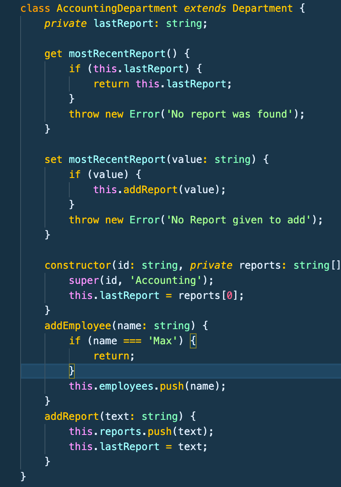

# Typescript Notes Section 5-B - Udemy Schwarmuller

## Classes and Interfaces (continued)

### Getters and Setters

- Getters and Setters allow the structured access and modification of private fields (or any fields but specifically for private ones)
- Getters have to **_return_** something out of their method body.

```
class AccountingDept extends Department {
    private lastReport: string;
    get mostRecentReport() {
        if (this.lastReport) {
            return this.lastReport;
        }
        throw new Error('No report found);
    }
    //...
}
```

- Setters work by allowing the writing to private fields in a structured way. See image below for both in action. Notice how the setter calls upon the already present addReport method on the class, just passing it the incoming value.
  
