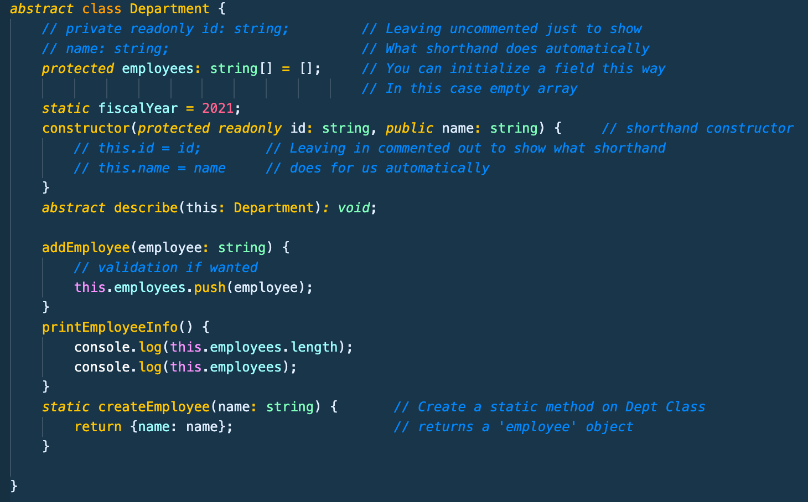

# Typescript Notes Section 5-B - Udemy Schwarmuller

## Classes and Interfaces (continued)

### Getters and Setters

- Getters and Setters allow the structured access and modification of private fields (or any fields but specifically for private ones)
- Getters have to **_return_** something out of their method body.

```
class AccountingDept extends Department {
    private lastReport: string;
    get mostRecentReport() {
        if (this.lastReport) {
            return this.lastReport;
        }
        throw new Error('No report found);
    }
    //...
}
```

- Setters work by allowing the writing to private fields in a structured way. See image below for both in action. Notice how the setter calls upon the already present addReport method on the class, just passing it the incoming value.
  

### Static Methods and Properties

- Like in other OOP languages. Static methods/properties allow the method/prop to be accessible with no instantiated object of the Class. Meaning the method/prop can be accessed directly off the Class itself.

- Usually like utility functions, or global constants, etc.

- Math.pi() and Math.pow() are examples of static methods already present in Javascript.

```
class Department {
    static fiscalYear = 2021;
    constructor(name: string) {
        //..
    }
    static createEmployee(name: string) {
        return {name: name}
    }
}

const emp1 = Department.createEmployee('Johnny');
console.log(emp1) // {name: Johnny}
console.log(fiscalYear) // 2021
```

- **_Important Note_** You **_cannot_** access static meths/props from non-static meths props in the class. For instance in the above code snippet.. we could not access fiscalYear inside the constructor. However a simple workaround would be just to call the whole class before the static meth/prop, and that would work. Below would work.

```
constructor(name: string) {
    console.log(Department.fiscalYear);
}
```

### Abstract Classes

- Kind of a cornerstone to the **inheritance** characteristic of OOP

- Methods defined with **_abstract_** keyword in front. The Class then also must be declared with abstract keyword in front. see snippet below

- The use case is when you want to _force_ a method to be present all the time, but when you don't know the exact implementation yet. Say for instance in the code snippet below. We know we want to have a 'describe' method for all implementations or extensions of the Department class. But we want to leave it up to the inheriting/extending classes to provide the specific method logic.

```
abstract class Department {
    constructor(protected id: string, name: string) {
        //...
    }
    abstract describe (this: Department): void;
}
```

- Notice the structure of the above abstract class and it's method especially. You don't define a method body for and abstract method, that is up to the extending or inheiriting class to do. But it **_must_** be done by whatever class extends this base abstract class. Also notice how you in TS must specifiy the **_return type_** of the abstract method.. Which makes sense since you aren't giving TS any context with no method body present.
  
  **notice how when we try to create an extended class of Department it \***requires**\* us to use the describe abstract method**
  

  - One Last special note on abstract classes. They **_cannot be instantiated_**. For instance for the above example. we could not do:

  ```
  const hr = new Department('id332', 'Human Resources');    // ERROR! Cannot instantiate Abstract Class
  ```

### Singletons and Private Constructors

- There's a pattern in OOP called the 'Singleton' pattern. It wants to ensure you only have **_one instance_** of a certain class. Useful in scenarios where you cant use static methods or props for instance.

- When you make a classes constructor private it's a little weird because you no longer are able to call that costructor from outside the class.. But this is the entire point. You can call it from within the class and use static props and methods outside of the class. Notice the getInstance method which is static. That can be called from outside the class and if nothing is yet present, will 'instantiate' the singleton
  

  - Notice and note how the above code can **_only be run once_** .. A singleton instance
