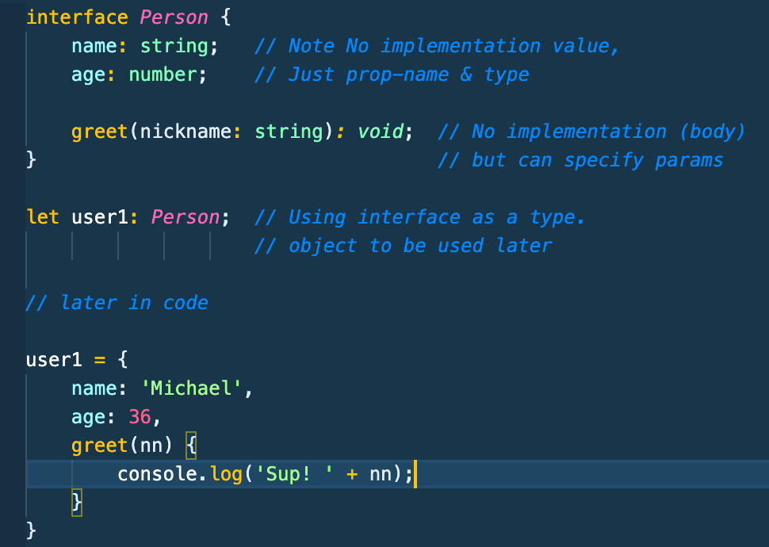
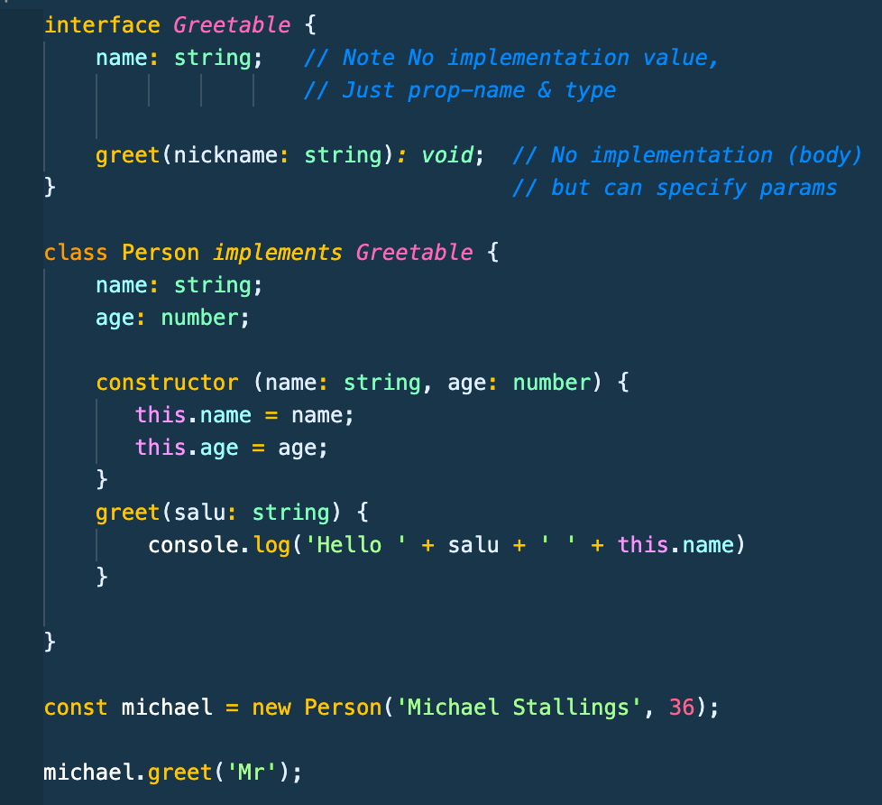
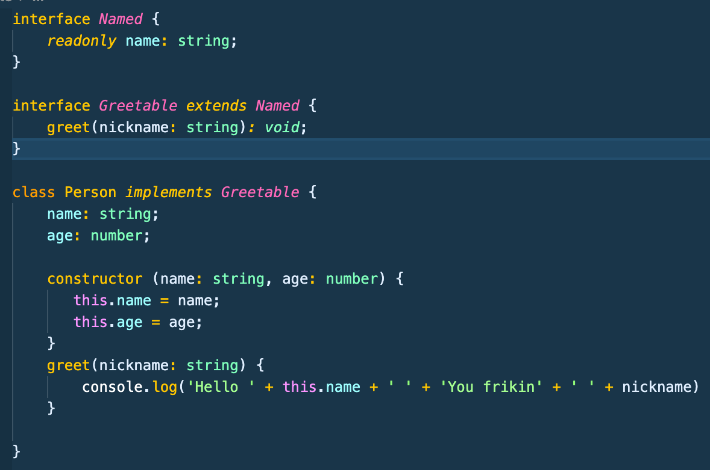
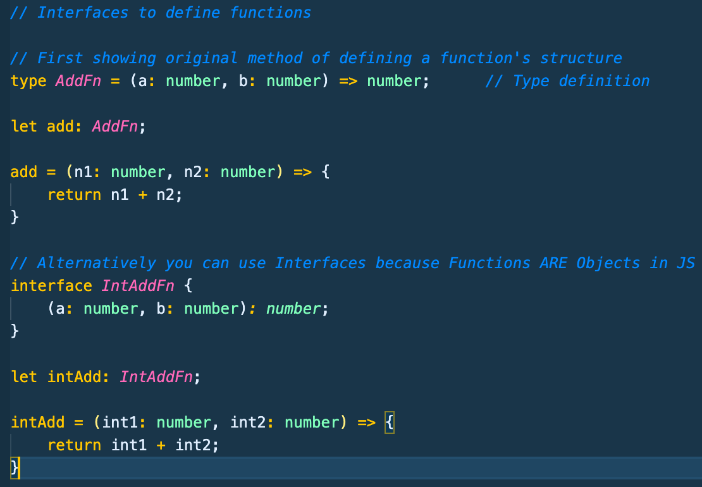
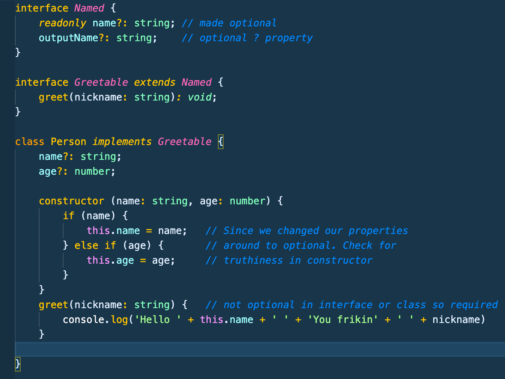

# Typescript Notes Section 5-C - Udemy Schwarmuller

## Classes and Interfaces (continued)

### Interfaces

- The most basic definition is an Interface **_describes the structure of an object, how an object should look_**

- Interfaces require any class that implements them to strictly implement the exact methods and properties on the Interface

- In Typescript the main function of Interfaces is to **_type check_** objects we're creating. In the full example below we create Person interface (type). Then define an object as being type Person.. Then later we instantiate the object with all the fields that the Interface requires.

  

- While you can sometimes use a type definition to do the same thing as an interface, they can't do exactly the same things:

- However when you define an Interface, it's understood you're defining object structures. Interfaces can also often be implemented in Classes. (Can't do that with types)

- Interfaces are similar to Abstract Classes as well. The big difference being Interfaces contain no implementation detail, whereas an Abstract Class can mix and match with overriding methods and such.

### Read-Only Interfaces

- Make clear that a property on an interface implementing class can only be set once and is read-only thereafter. You can't use 'private' on Interfaces, but you can use readonly.

### Extending Interfaces

- A way of extending inheritance to interfaces

- Very useful in that while you **_cannot_** extend a class by more than 1 base-class. Using Interfaces, the methods and properties you want to have a class implement is pretty much unlimited.

### Interfaces As Function Types

- Interfaces can not only be used to define the structure of an object, they can also be used to define the structure of a **function**

- Essentially this is a straight-up replacement for function types we went over earlier in course

### Optional Properties and Parameters

- Pretty straightforward concept: If you have an interface or class and want a property or method to be optional as to it's required implementation. mark it with an **_?_**. Also can be used in functions.

- Probably very useful in internal use of interfaces, but on a development team, adding too many optional properties or params, espcially in interfaces, might defeat the purpose of defined structure through use of interfaces in implementation of sub-classes.

- Also when using optional props/params.. You'll need to use if-check **_validation_** more often to prevent against potential undefined's
