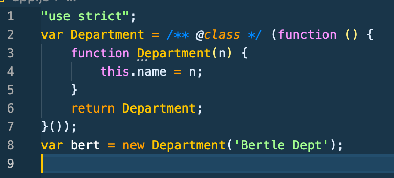
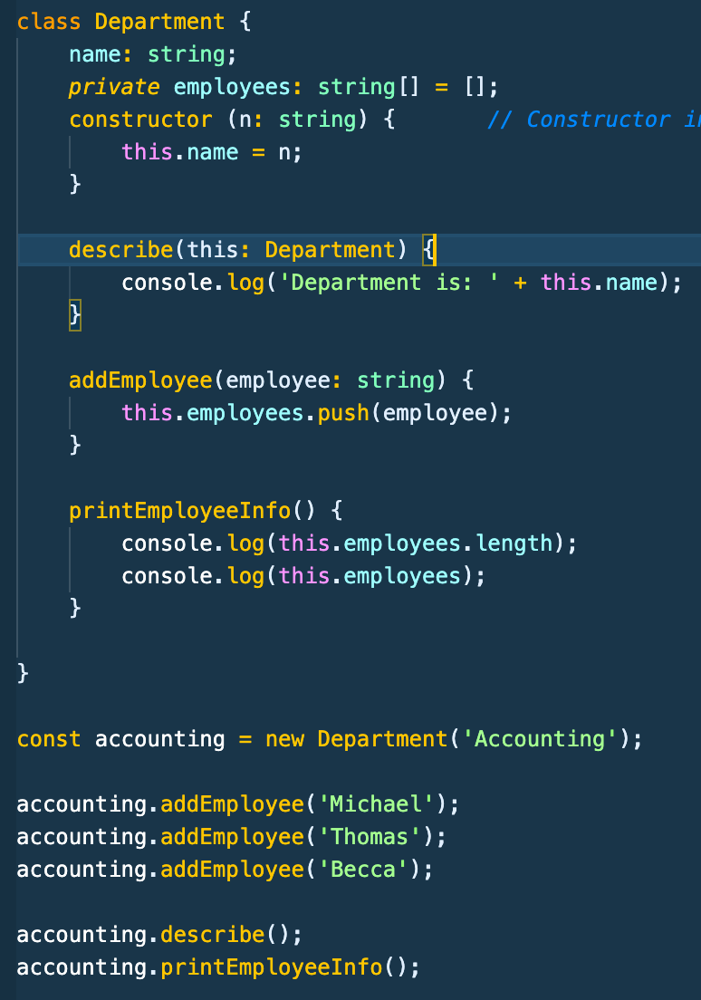

# Typescript Notes Section 3 - Udemy Schwarmuller Course

## Classes and Interfaces

### Constructors

- Initialize instance objects of classes. In the converted javascript, there are no fields like there are in Typescript. So all field assignments will appear in the constructor in ES6.
- Going further back to ES5 things get wonky.. ES5 and before will attempt to use constructor functions (factory functions). So those are not going to look _anything_ like modern class syntax. Shown below first is the modern class syntax we use in Typescript. Below that is an image of what the compiler transpiles that to for ES5 javascript.

```
class Department {
    name: string;

    constructor (n: string) {
        this.name = n;
    }
}

let bert = new Department('Bertle Dept');
```

**_transpiles to:_**


#### THIS

- Already knowing this keyword points to the object on which it's instantiated, an important tool that can be used in typescript to _ensure_ that when a class's method is called anywhere in the code, that it's _this_ will indeed refer to the class that it's constructed in. This is done by passing what may look like a parameter, but is not, to the method you want to _'bind'_ it's parent class (and thus it's fields) to.

```
class Department {
    name: string;
    constructor (n: string) {
        this.name = n;
    }
    describe(this: Department) {  // notice passing this to method param ensuring type
        return this.name;
    }
}

let accounting = new Department('Accounting);

let literalDept = {
    field: string;
    field: number;
    describeClone: accounting.describe
}

literalDept.describe() // This will NOT work

let literalDept = {
    field: string;
    field: number;
    name: 'Dummy'   <-- Now this object literal will have it's own this.name
    describeClone: accounting.describe
}

literalDept.describe() // THIS WILL THOUGH return 'Dummy'
```

### Private / Public Modifiers

- Similar to other OOP languages.
- Often especially when working on bigger teams, you'll want to lock-out certain fields on your classes (or objects instantiated from) from being altered. You can do this with the **_private_** modifier
- Notice how we make the employee field private here:
  
  **making employee field private would make below code impossible. Safe-ing your classes and objects.. Only methods from within the parent class (or objects from) will be allowed to modify the private field now**

```
accounting.employees[2] = 'Anna';   //ERROR!
```

### Shorthand Class (Constructor) Initialization

- In instances where you have a LOT of fields to intialize in the constructor, use the following shorthand:

```
class Department {
    // notice no fields that would be required for constructor
    constructor(private id: string, public name: string) {
        // notice empty
    }
}
```

- The above will automatically create a private ID field and public name field when the class is instantiated as an object (and those values are passed in)
