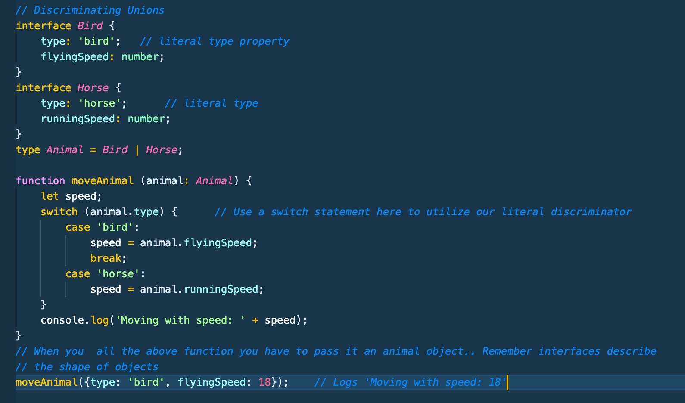

# Typescript Notes Section 6-A - Udemy Schwarmuller

## Advanced Types

### Intersection Types

- Pretty straightforward concept. Allows the combining of type definitions to shape objects.


- and in the case of literal values.. it would be the type that the intersecting types have in common. Number here
  

### Type Guards

- A safeguard to **_avoid runtime errors_**

- There may be cases where after making a union type, the TS compiler can't determine which base type you're trying to draw from. See the image below for this example. We create a union type UnknownEmployee, and notice when we go to make our print function, our first c-log will compile fine b/c 'name' prop exists on both types. Howevr compiler red-lines 'privileges' b/c it can't be for certain which type to use from the union.
  

- You can't just use a _typeof_ if-check for a special type property.. **_the if-check runs at run-time anyway_**, at which point your typescript typing and properties will be gone

- **_By using the 'in' keyword we can check it_** This is javascript that can check if the key of that object is present at runtime. so the following check would work:

```
if ('privileges' in emp) {
  console.log('Prvileges: ' + emp.privileges)
}
```

- Notice now how our if-checks for the key presence **_in_** the object passes and prints to console
  

- Using **_instanceof_** check
  

### Discriminated Unions

- A pattern to use when working with union-types to make type-guarding easier.

- Essentially it involves setting a type literal on the interface you're using to model you objects. Thereby adding an extra layer of certainty and security. When used in vscode. you get helpful autocompletion.


