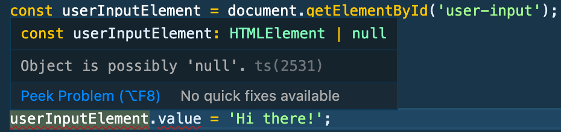
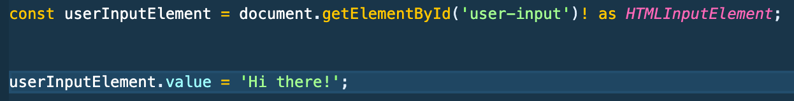
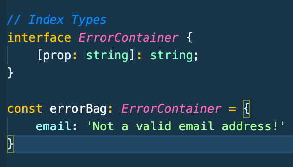
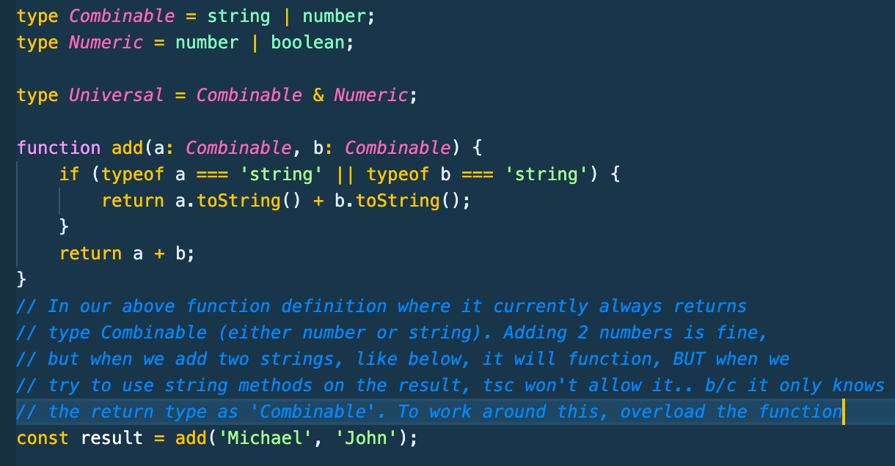
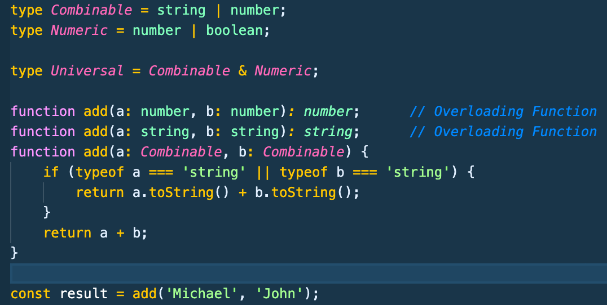
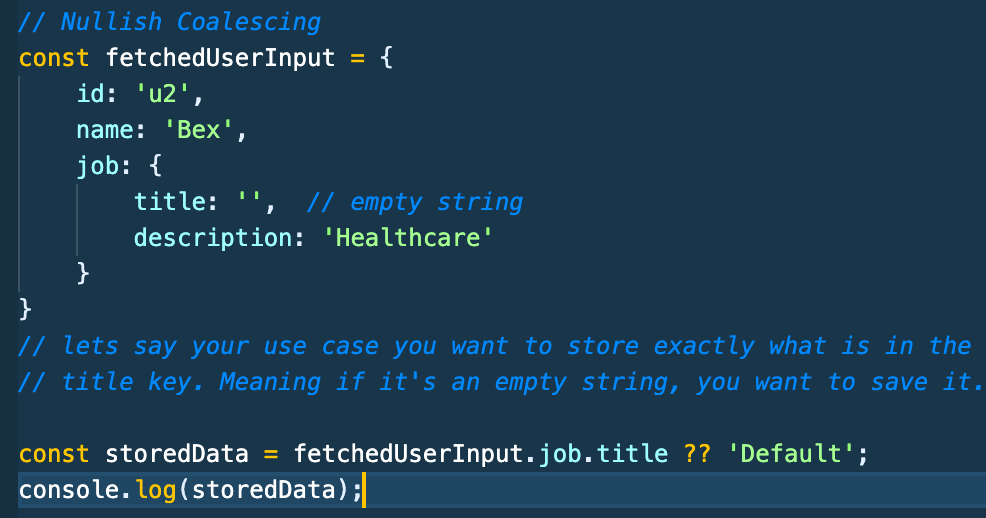

# Typescript Notes Section 6-B - Udemy Schwarmuller

## Advanced Types (continued)

### Type Casting

- Essentially the same concept as in other OOP's, but in TS it becomes very useful espcially in cases where you're interacting with the DOM.

- Explicitly **converting** one type to another **where the conversion is possible**.

- A common use case is when trying to get access to a DOM element by it's id (getElementById). Typescript doesn't **look into** your html file to see what id's and classes you've assigned to elements. So it's always going to warn that it can't be sure of the type in this case.
  

- The way to fix the above lack of clarity for the TS compiler is to **typecast** using **_'as'_** keyword our userInputElement variable to what we know it will be. **Also in the above example you'll want to add an exclamation point to tell TS you know it won't be null**

  

- An alternate way of typecasting is using angle-brackets before the value.

```
const userInputElement = <HTMLInputElement>document.getElementById('user-input')!;
```

- The exclamation point operator **_!_** tells the compiler that you are certain the element will not return **null** at runtime.

### Index Properties

- Let's think of an example problem where we want to have a universal error object for our app. We'll define it with an interface, but we aren't sure exactly what details the object will take on later. One example we might want is :

```
{
    email: 'Not a valid email address',
    username: 'Username not found'
}
```

- The way to define 'template' like interfaces is to use Index properties where you use **square brackets** to define what the key type should be, and what the value type should be, as in :

  

### Function Overloads

- Makes defining multiple function signatures possible.

- Take a look at the example below with the comments



- While you certainly could use type-casting to tell TS you will be returning say for instance **_as String_**.. that's not optimal, so use overloading instead:



### Optional Chaining

- Safely access nested objects and avoid runtime errors when/if they don't exist

- Say you're retrieving data from a backend and you can't be certain of the object structure, or that a property exists on it or not

- Say you're getting data back from db that's structured like below

```
const fetchedUserData = {
    id: 'u1',
    name: 'Max',
    job: {
        title: 'CEO',
        description: 'Self-Employed'
    }
};
```

- The problem is you're getting lots of records, and on a few of these, the job field might be undefined. The classic javascript way of solving this issue is shown below using an and-check:

```
console.log(fetchedUserData.job && fetchedUserData.job.description)
```

- However TS makes it even easier by utilizing the **_question mark ?_** operator. In our above example we would simply write:

```
console.log(fetchedUserData?.job?.title);
```

### Nullish Coalescing

- Helps deal with potentially nullish data. Similar in utility to optional chaining, but for cases where the unknown data to-be-retrieved might be null or undefined.



- To avoid an error/exception. TS allows for nullish coalescing by use of the **_double question mark ??_** operator
