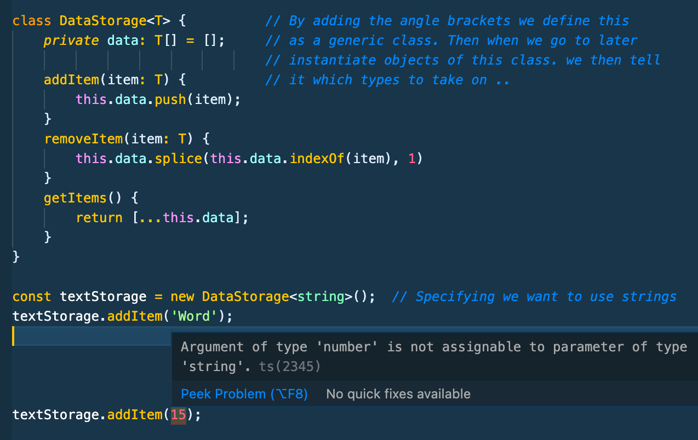
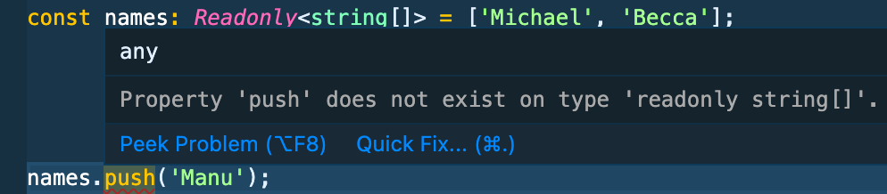

# Typescript Notes Section 7 - Udemy Schwarmuller

## Generics - Ultimate Flexibility WITH Type Safety

### Built-In Generics

- Generics are a way of maintaining information about inputs from start to finish **especially when that input data is processed/manipulated in complex ways**, and making highly reusable components.

- Intellisense and Typescript will display these as (and the signature is):

```
Generic<T>
```

- For demonstration. Both forms of typing are exactly the same. One in the form we've been using till now, and the other utilizing the built-in Array generic.

```
const names: string[] = ['John', 'Mike'];
const names: Array<string> = ['Donny', 'Walter'];
```

- This can be especially useful for extra type safety in the example below. The **_reason_** you want to go through the extra step of specifying the Generic type is that when you get this data back from the promise example. You'll want to be able to do string methods on it, or array methods, et cetera.


### Custom Generics

- Lets start with an example. We make a (redundant) function called merge to merge two objects.
- Notice the first console log works fine. However when we store the merged object then try to access any of the properties on it.. Typescript red-line errors. **_because Typescript has no way of knowing what took place inside the body of your custom merge function_**


- Notice how above when we define our function, we simply type our inputs as objects, which is correct, but it won't be enough to carry detailed information **_about_** those objects through the body of the function. _Enter Generics_


- Notice above we follow the standard format of specifiying T and U as the inputs to our Generic. Shown is what the TS Compiler (vscode) understands when we add the Generic information. Notice how it explicitly returns the intersection of both our input types T and U. This is how you maintain the input type information all the way through the function.

- You can specify exactly to TS what you want the function call to resolve the return to. But the compiler does this on it's own .

### Type Constraints on Generics

- In our last example we are using a Generic on our merge function, but what we are in affect telling TS is that T and U can be **_any_** thing .. TS is just smart enough in the above example to realize they are objects (because the function body only works on objects). _But in many cases you don't want to leave your Generic (inputs) ambiguous like this._ **_Enter Constraints:_**

- Back to our above example of merge first (pre constraints). IF we were to pass merge something like the following. **_Note how the returned object just simply drops the '100' number we passed at the end.. this is a fail-safe built into the Object.assign built-in.. But you will rarely be able to rely on built-in fail-safes_** Generic Constraints will solve this problem by never letting the merge arguments compile in the first place

```
const storedMerge = merge({name: 'Michael, age: 36}, {description: 'Awesomeness'}, 100);
console.log(storedMerge);
// {
    name: 'Michael,
    age: 36,
    description: 'Awesomeness'
}
```

- By using constraints **_utilizing extends (object type)_** syntax. The compiler notifies us that number 100 isn't of type object. Important to realize this would not have happened in our original version of just: function merge<T, U>(objA: T, objB: U) {//...};

  

- And since we added constraints. TS Compiler and VSCode notify us of the above issue. And we can easily correct to the following to compile error free _(and ensure error free runtime)_

```
const storedMerge = merge({name: 'Michael', age: 36}, {description: 'Awesomeness'}, {'level': 100})
```

#### More on Generic Functions

- Below is an example of when we might want to create our own type or interface in this case, and pass it through our generic to the function.


### 'keyof' constant

- In an example case like below, Generics can help us.
  

- Using keyof property we can ensure any function calls will have the correct structure
  

### Generic Classes

- These allow you to _really_ see the potential utility of Generics. See the example below where we Generic type our storage class with a stand-in, customary 'T' (could be anything just like a parameter, but T and U are the conventions).
- **_Note:_** If we had not specified this class as Generic by using the anglebracktets , TS would not allow it to compile.. Because the types of the input parameters would be unknown.
- At the bottom you'll see that at instantiation we specify our object will be of class DataStorage<string>.. Now TS knows we are working with strings, and using the methods with strings is perfectly fine. However you'll see at the very bottom if we try to pass a number into our class.. TS notifies us of the mis-match and won't compile.



- When we want to store numbers in this case.. All that's required is instantiate a new object of the same class (DataStorage) and specify 'number' in the Generic type anglebrackets, and voila! .. **_This is where the reusability and flexibility of Generics can really be seen_**


- Now there is one limitation to the above DataStorage Generic example, and that is objects. If you were to pass an object into the generic 'constructor' of a new say objStorage object.. Everything would appear to work fine, up until you tried to removeItem method. Because you're storing objects, The indexOf sub method of removeItem won't work.. essentially because you'd be passing in a new memory reference when you called the method. So in DataStorage's case. You really should define it as below, so that only primitive types can be used. And if you want to store objects, create a seperate Generic Class

```
class DataStorage<T extends string | number | boolean> {
    //...
}
```

### Generic Utility Types

#### Partial

- Here we're creating an interface with our data structure. Then we create a function to modify our object. Notice how TS complains about let courseGoal = ... The reason is courseGoal is an empty object at intialization and doesn't have the req'd properties defined in the interface. One utility Generic to help with this case is **_Partial_** .. What you do is pass your object or interface to the Partial generic. And **_essentially what TS does is make all the fields on the interface optional_** .. This way you can compile the code and clearly you're adding the properties later in the function.

- After making our CourseGoal interface **partial**, it's going to complain about the return type.. because it is then of type Partial<CourseGoal> and we specify our return type of the function as CourseGoal. So you'll need to **_type-cast_** the return value back to Course Goal as seen.


#### ReadOnly Utility

- You can lock properties on objects .. See below example


