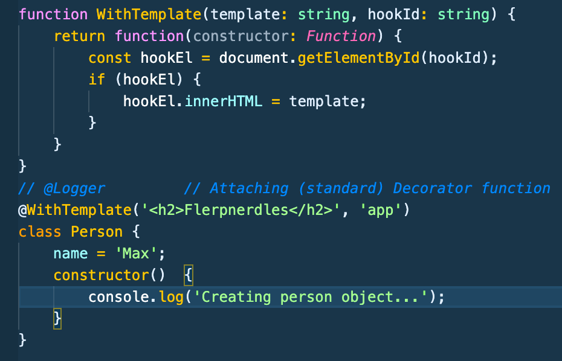
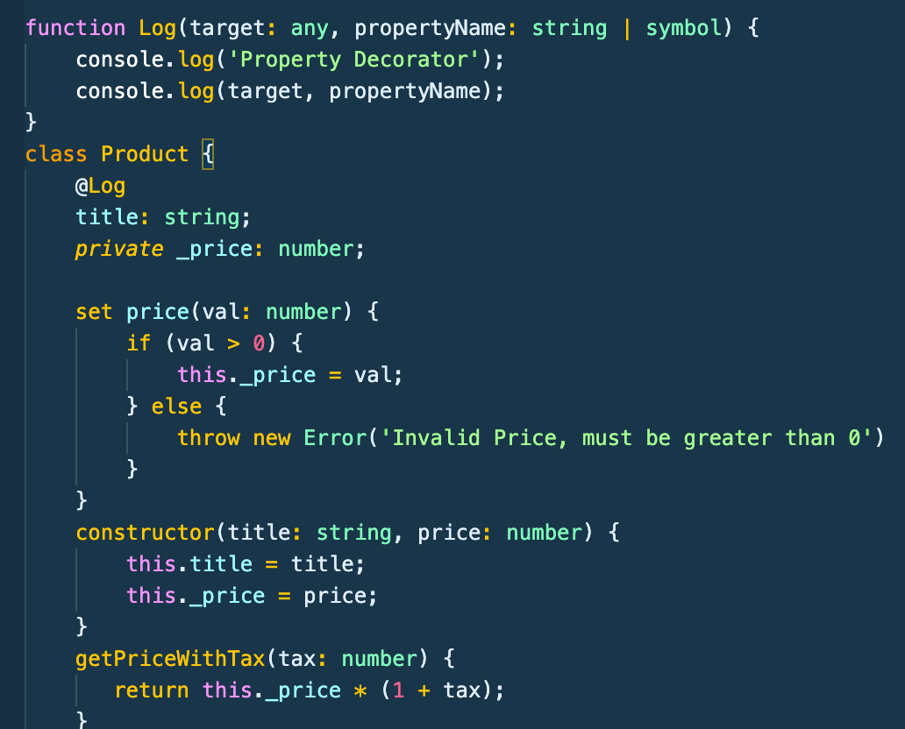

# Typescript Notes Section 8 - Udemy Schwarmuller

## Decorators

### Class Decorator

- A decorator is simply a function that you'll apply in some way throughout your code, usually applied to classes. And the utility of decorators really extends to other developers and/or team members who might be working with the code later on.

- Decorators must receive arguments. The number of arguments depends on where the decorator is used though.

- Decorators are called with the following syntax, note there are no call parenthesis

```
@DecoratorName
class Person {
    //...
}
```

- Decorator functions _'run'_ as soon as the code is evaluated.. In the example above.. **_DecoratorName would run at compile, the class would not be required to be instantiated for the decorator to run_**.

#### Decorator Factories

- You can also create a decorator _factory-function_ so that the configuration can be done when it's assigned.

- These are the same as basic decorator functions, **_except that they return a function_** which is then used to decorate the class, now _able to receive dynamic input_ and in this case **_the function call is required_**


#### More with Decorators

- You start to really see the power/potential of Decorators in the following example. We define WithTemplate decorator to be a factory-function taking an input of a template string and the hook or element we want to attach to in the DOM. When we initialize the decorator above the person class we hardcode in some html for the template and speciy the app div. The heading is already waiting when the page loads.



- These Decorator functions and factory functions really can provide great features and extensibility to your code, especially in the context of building and publishing a library (for instance)

- Decorators can be chained. Or at least multiple Decorators can be attached to a class. **They execute from the bottom up, i.e. the Decorator closest to the class will run first.**

#### Property Decorators

- Decorators aren't limited only to Classes.

- When you add a decorator function to a property, it must receive **_2 arguments_** The **_target_** and **_property name_**



#### Accesor and Parameter Decorators

- Can also be applied to getters/setters and parameters.

- Both Accessor and Parameter (method) Decorators **_take 3 arguments: the target, the name, the descriptor_**


- Parameter Decorators take 3 arguments: **_target, name, and numerical position of the parameter_**


#### Execution Order

- It's important to keep in mind that **_All decorators will execute when the class is defined. They do not execute at runtime when a method is called, etc _**

- They can of course be configured to execute when you call methods or at runtime (for instance when working with binding listeners).. But by default they do not
