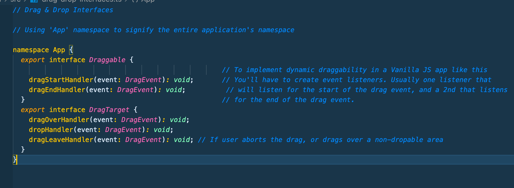
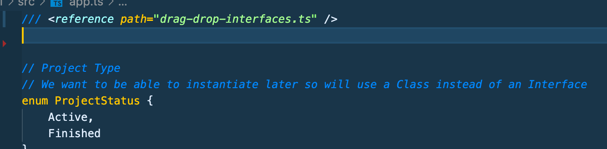
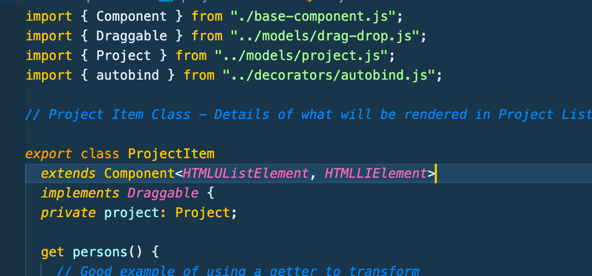
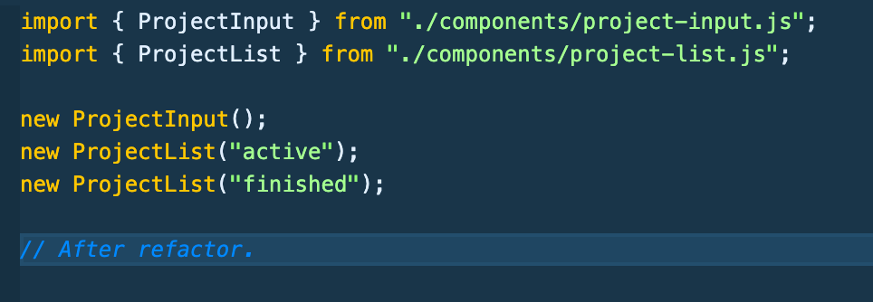
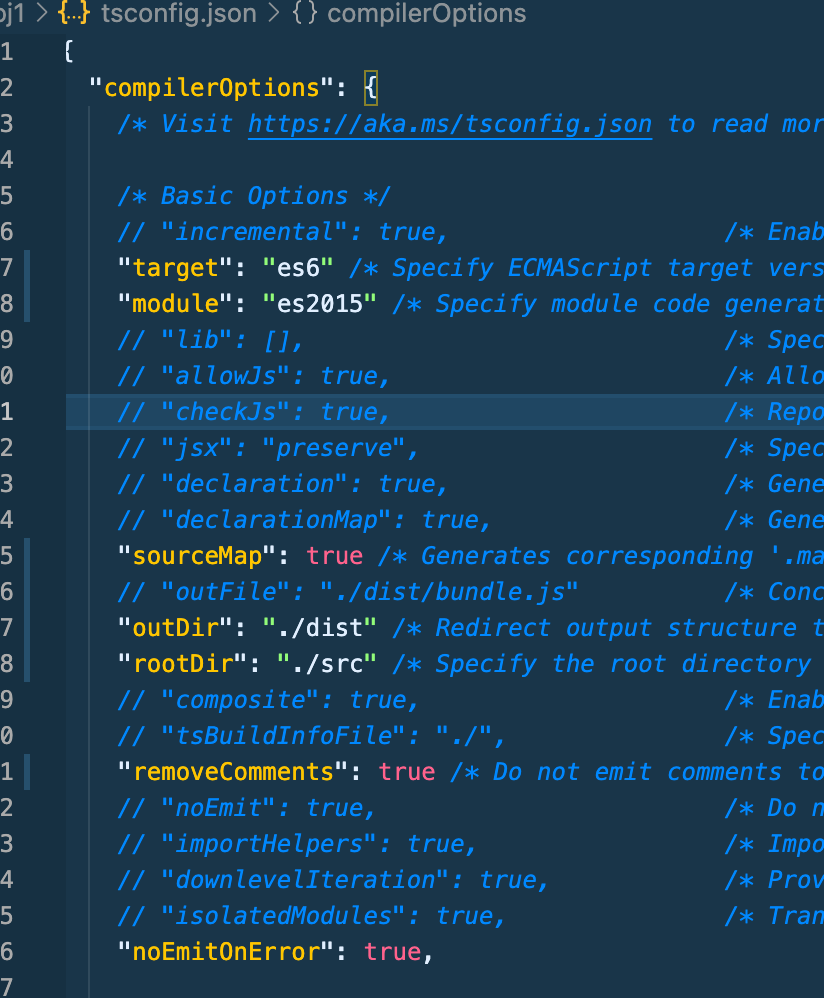
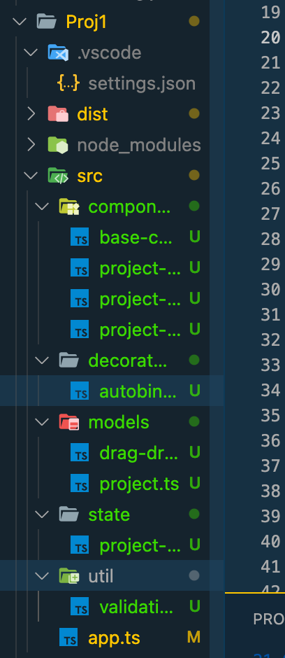

# Typescript Notes Section 9 - Udemy Schwarmuller

## Modules and Namespaces

### Namespaces

- A syntax feature allowing you to group code together and import it via the namespace

- TS Will also bundle the files in the namespace together, so that's not required to be manually done

### ES6 Modules

- The **_more modern way of segmenting your code._** This is supported by ES6 and above using import and export statements

- You'll only need one \<scriipt> element in the browser, modern browsers can handle the import/export nature of Modules

### Webpack

- Of course Webpack can also be used to segment and bundle files, especially on large applicatinos, effieciently

#### NOTE: We will be over in the Vanilla JS Project folder (Proj1) for the demonstrations of this section

### Namespaces In-Depth

- These work a lot like other OOP languages. Honestly though from demonstration, they might not be worth the hasstle, **_especially when compared to ES6 modules_**, At any rate including some screenshots below of how you might work with them.

- Note: You have to export the elements you want from the seperated file. in this case it's drag-drop-interfaces.ts. Then you also must use the special **_///_** exactly-three slash 'xml import' statement to bring everything in that namespace in.



- The 'reference' xml statement in App.ts



- Then what would be required is for you to wrap all of the App.ts code in a

```
namespace App {
    //.. All code inside here
}
```

- Like I said, moving forward to ES6 Modules

### ES6 Modules

- ES6 Modules can give you all the code separation of concerns that namespaces do, with the added safety that namespaces sometimes can be lacking. Namely, if you don't explicitly import what you need with ES6, the project won't compile/ will fail and won't get into some edge-case situations where namespaces might allow compilation because of 'lateral-inheritance' from a related component or file.

- ES6 **_relies on the import and export keyowrds_**

### Drag-n-Drop Project After ESM Refactor

- See the images below to see the ES6 Module formatting of separation of concerns. Also note the new folder structure we use and the TSconfig options.



---



---



---



### A Few Other Notes On ESM

- You can of course 'bundle' exported elements coming out of the same file. For instance we have in our current code:

```
import { Validateable, validate } from '../util/validation.js';
```

- To make things easier if you want, you could 'bundle these like the following using the **_everything asterisk_**, thereby being able to dot-notate access the individual elements:

```
import * as Validation from '../util/validation.js';

//...

Validation.validate(//...);
```

- You can also **alias** anything using the **as** keyword as shown above. **_Which could be useful in avoiding name clashes_**

- **Default Exports**: When you only have one element to export, you can use the **_export default_** modifier before the element and then where you import it, you know longer need the curly-brace syntax **_and the name you pick is essentially an alias now, since the default export isn't going to change. For the snippet below, we could have imported the name as anything, as Component is always what's the default_**

```
export default abstract class Component<T, U>{
    //...
}
```

- In the import file:

```
import WhateverYouWannaNameIt from '../components/Component.js';
```
