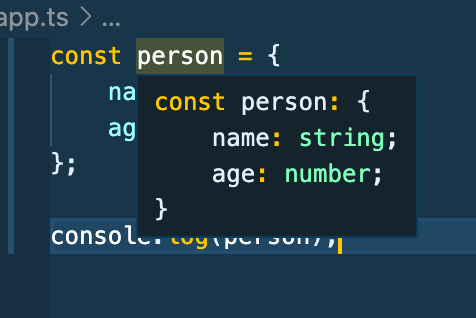
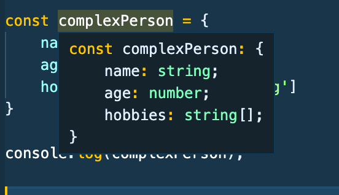

# Typescript Notes Part 1 - Udemy Schwarmuller Course

## Types - Core Concepts

<hr/>
### Core Types

<hr/>

_NOTE_ : Typescript types are all lower case, as shown below, not uppercase like in regular javascript.

- **number**: (Ex: 1, 5.3, -10) : All numbers, no differentiation between integer, float, double, etc.

- **string**: (Ex: "Hi" `Hi`) : All text values

- **boolean**: (Ex: true, false) : Just these two, there are no 'truthy or falsy values in typescript. The same is actually true for javascript. Truthy/Falsy concepts is something javascript does at runtime 'behind the scenes' and is not related to any actual datatype.

- **object**: (Ex: {age: 30} ) : Any javascript object, more specific types, as in the _type_ of the object itself are possible in TS.

- **array**: (Ex: [1, 2, 3], ['Something', 'Or', 'Another'] ) : You can have mixed data arrays in Typescript. But you can also have strict types within arrays in TS.

- **tuple**: (Ex: [1, 2] ) : Tuples are **fixed-type** _and_ **fixed-length** arrays.

- **enum**: (Ex: enum { Smith, Johnson, Carry } ) : Enums allow a developer to define a set of named constants. Using enums can make it easier to document intent, or create a set of distinct cases. TypeScript provides both numeric and string-based enums. Automatic behavior is for enumeration to start at 0 and increment up.

- **any**: (Ex: let rando: any;) : The default type for an uninferrable object. Obviously can be of _any type_ .. This is the least strict type. You'll usually want to avoid using any type because you might as well be writing vanilla javascript at that point.

<hr/>

### Type Assignment and Inference

- Typescript will **_infer_** the type when a variable is instantiated, as in: let numb = 1; ... however if you leave a variable only declared and not instantiated, you should explicitly type it as in: let numb: number .. later on in the code you can now do numb = 1;

<hr/>

### Objects In Typescript

- Typescript objects are structured differently than regular js. Take a look at this photo: 
- The ts compiler infers the _object type_. Instead of key-value pairs, ts uses **_key-type_** pairs.
- So object-types are present in TS to describe the _type_ of object being utilized. This allows (and requires) you to be detailed in describing your object.

```
const person: {
    name: string;
    age: number;
} = {
    name: 'Michael',
    age: 36
}
```

- The above code snippet is essentially what Typescript does when you give it an object.

<hr/>

### Arrays

- Arrays are flexible in Typescript, they can have mixed data types (any) or be strict with thier data types. See the image below.
  
- Notice how TS displays the type of string[] (String Array).
- Very similar to contemporary strongly typed languages, if you want to declare the array prior to it being instantiated with data/elements, you write:

```
let favoriteActivities: string[];
favoriteActivities = ['jump-rope', 'fishing'];
```

- If the datatypes are not known at declaration, or if you want flexible/mixed datatypes in your array you type them as **: any[]** :

```
let randomData: any[];
randomData = [ 'breakfast', 25.5, true, {troll: 'smurf'} ];
```

- Because TS allows you to strictly define array types, this allows you freedom to use (in the instance of string[]) string methods **_without worry of runtime error_**:

```
let names: string[];
names = ['John', 'Sarah', 'Joe'];
    for (name of names) {
        console.log(name.toUpperCase());
    };
```

<hr/>

### Tuples

- Typles are fixed type and fixed length 'arrays'. The best way to explain them is an example where you have say, a person object.. with a key you want to have two properties in that are always of a certain type, and in a certain order. If this is the case, you'll want to override Typescripts auto-inference, and explicitly type all the members of the object, but for the reason of explicitly defining the tuple key. In this example it will be 'role' which we always want to have a number as the 1st element, and a string as the 2nd.

```
let person : {
    name: string;
    age: number;
    role: [number, string]; <--tuple definition
} = {
    name: 'Michael',
    age: 36,
    role: [2, 'author']
}
```

- _note_: There is one gotcha using the push array method. Typescript cannot catch an attempt to push a new element, of any type, into a Tuple. Just be aware.

<hr/>

### Enums

- Enums allow a developer to define a set of named constants. Using enums can make it easier to document intent, or create a set of distinct cases. TypeScript provides both numeric and string-based enums.

- If you dont explicitly define the values for your enums, typescript will assign them zero-based indexes like arrays. You can however explicitly set the values to strings or numbers.

- Notice the syntax is similar to a class in other strongly typed langs (no equal assignment like obj's arr's).. this is the first example of a _custom_ type in TS

```
enum Role { ADMIN, AUTHOR, DEVELOPER }
console.log(Role.AUTHOR)  -->  1

enum Colors {
    Pink = '#E79599',
    Red = '#8B0000',
    Olive = '#476549',
    Blue = '#ced6df'
}

console.log(Colors.Pink);  -->  #E79599
```

<hr/>
