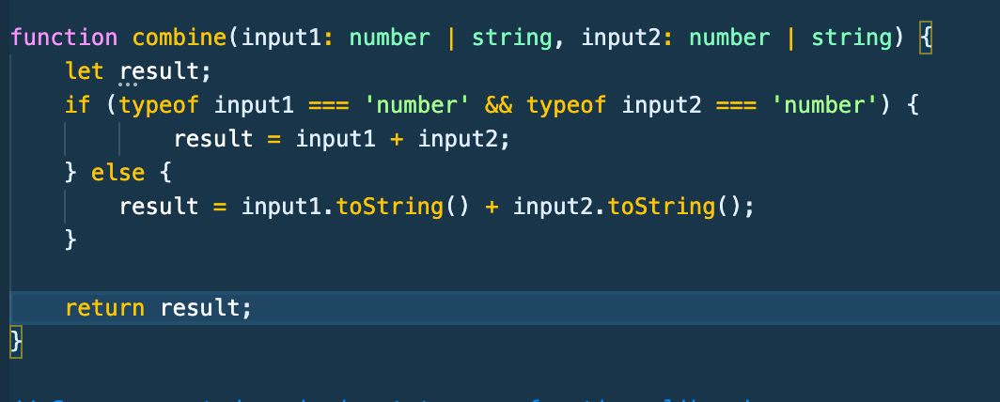
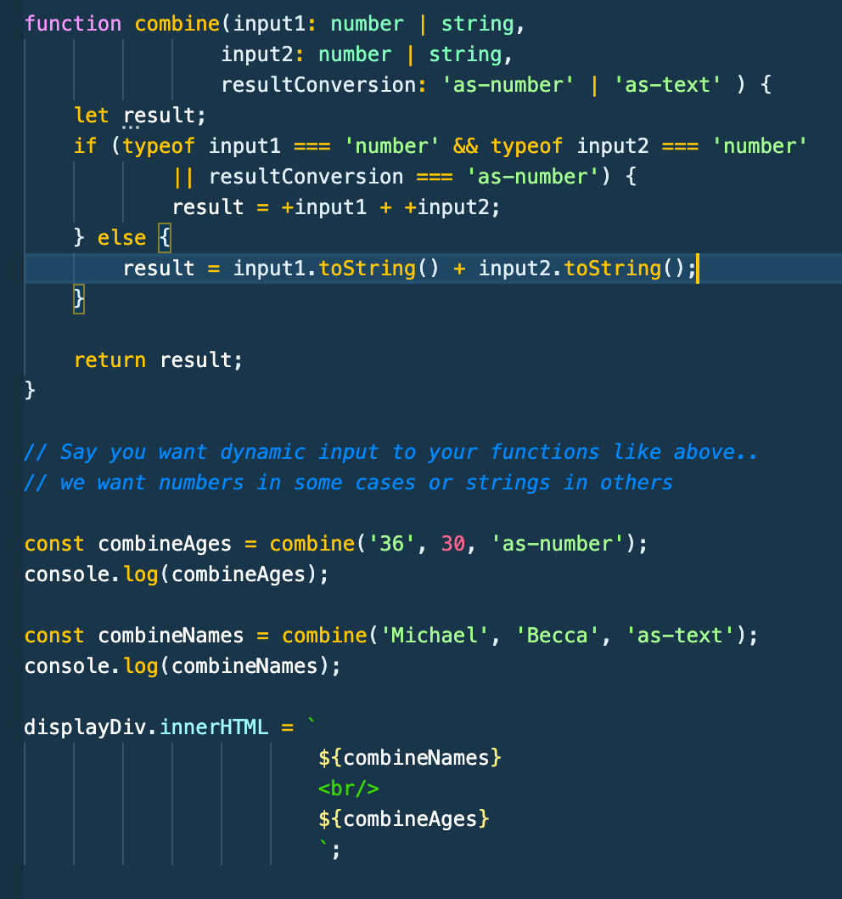
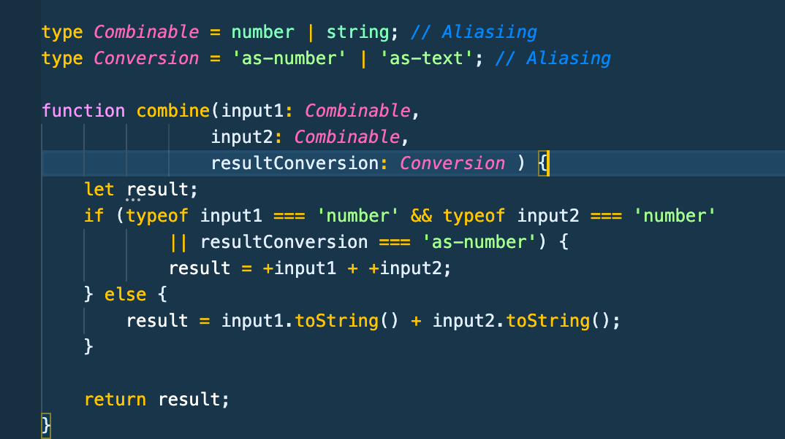
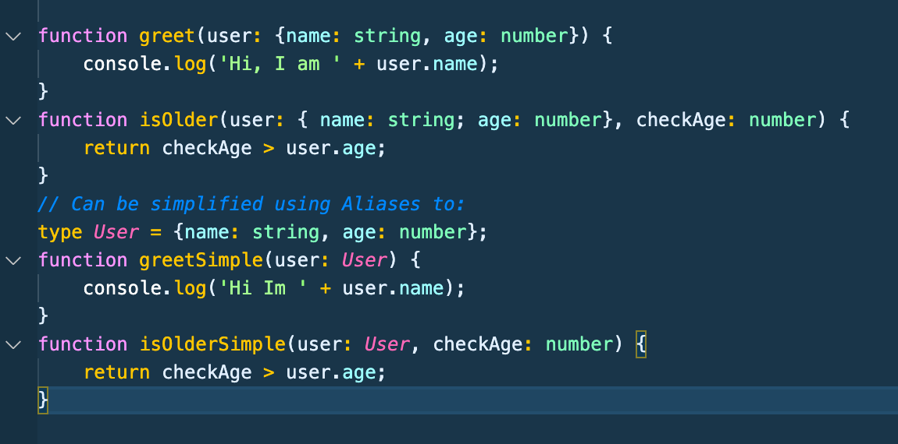
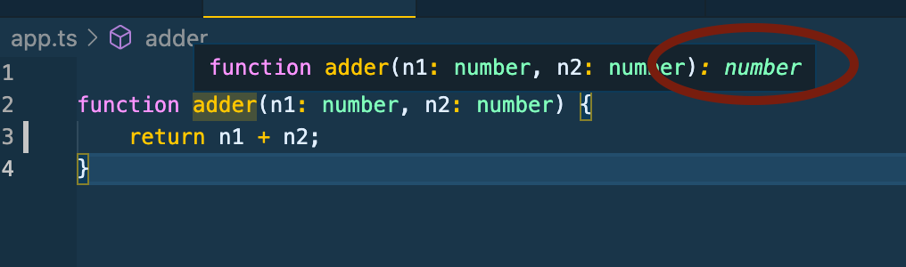
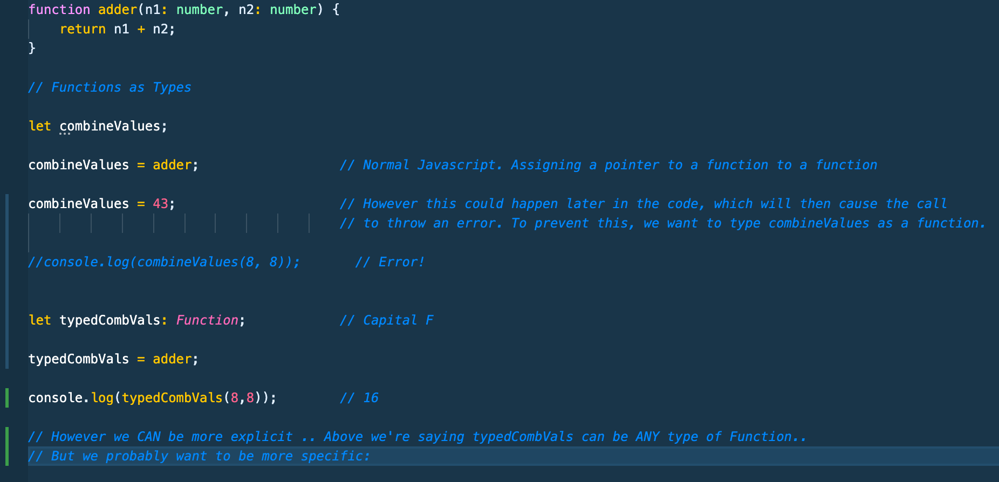
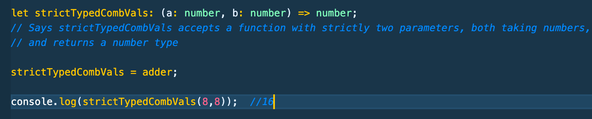
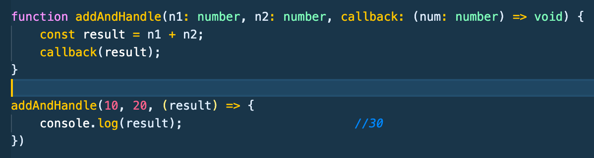

# Typescript Notes Part 1-B - Udemy Schwarmuller Course

## Types/Core Concepts Continued

<hr/>

### Unions

- Take form (varName: number | string) . They allow multiple types, this can be useful when trying to write dynamic functions with multiple types of input.
  

- Above we use an if check in our logic to handle the different type input cases.

<hr/>

### Literals

- A literal is a more concrete sub-type of a collective type. What this means is that "Hello World" is a string, but a string is not "Hello World" inside the type system.

- There are three sets of literal types available in TypeScript today: strings, numbers, and booleans; by using literal types you can allow an exact value which a string, number, or boolean must have.

- In this example we set a string literal 'resultConversion' to allow our function to determine it's output (no matter what the input type). Notice how we set reslutConversion to the union type of the string literals 'as-number' and 'as-text'. Also note how this is setting a type and not assignment like to a const (no equals sign)
  

<hr/>

### Type Aliases

- Use aliasing to change the naming of a type. This is most (and honeslty only) useful when Unioning two or more types. Like in our above example of using literals, see the below image for a format that utilizes aliasing to make the code cleaner and more modular.
  
- Aliases can also be used to simplify code with **_complex objects_** for example:
  

<hr/>

### Function Return Types and Void

- Along with being able to assign types to parameters, you can also assign the return type.

- Notice in the following image how the Typescript compiler infers the return type when and where it can. It's the part after the parameters closing paren
  

- The **void** return type is similar to other languages. It defines a return type of nothing.. i.e. when a conaole.log is returned.

```
function printResult(num: number): void {
  console.log('Result: ' + num);
}
```

- _Technically speaking_, and maybe somewhat confusingly: The above functions return type is void, however if you typeof(printResult(3)), it will be _undefined_ . This is because javascript uses undefined to signify what is essentially a void return type. You _cannot_ however assign undefined as a functions return type _when nothing is returned_ (you can however set variables to undefined type and set a functions return type as undefined **_IF_** it returns something out of the body).

### Functions as Types

- Values can be typed as Functions in TS. This can be especially useful when you want a specific type of function to control the behavior of your code. The below image snippet is the basic use of a generic Funtion type. and below that we'll go in to being even more specific with your function types.
  

- Using what looks similar (_but not the same as_) arrow functions, we can specify exactly the shape of function type we want to allow.
  

- In the same way as above we can also specify the funtion type shape for callbacks used in functions.
  
