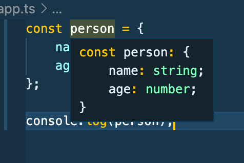

# Typescript Notes - Udemy Schwarmuller course

## Types

### Core Types

_NOTE_ : Typescript types are all lower case, as shown below, not uppercase like in regular javascript.

- **number**: (Ex: 1, 5.3, -10) : All numbers, no differentiation between integer, float, double, etc.

- **string**: (Ex: "Hi" `Hi`) : All text values

- **boolean**: (Ex: true, false) : Just these two, there are no 'truthy or falsy values in typescript. The same is actually true for javascript. Truthy/Falsy concepts is something javascript does at runtime 'behind the scenes' and is not related to any actual datatype.

- **object**: (Ex: {age: 30} ) : Any javascript object, more specific types, as in the _type_ of the object itself are possible in TS.

### Type Assignment and Inference

- Typescript will **_infer_** the type when a variable is instantiated, as in: let numb = 1; ... however if you leave a variable only declared and not instantiated, you should explicitly type it as in: let numb: number .. later on in the code you can now do numb = 1;

<hr/>

### Objects In Typescript

- Typescript objects are structured differently than regular js. Take a look at this photo: 
- The ts compiler infers the _object type_. Instead of key-value pairs, ts uses **_key-type_** pairs.
- So object-types are present in TS to describe the _type_ of object being utilized. This allows (and requires) you to be detailed in describing your object.

```
const person: {
    name: string;
    age: number;
} = {
    name: 'Michael',
    age: 36
}
```

- The above code snippet is essentially what Typescript does when you give it an object.
